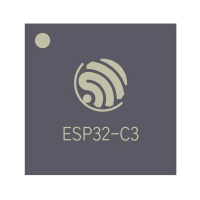

<h1>ESP32-Based Project</h1>

#### Used Board:
<table>
  <tr>
    <td>
      
    </td>
    <td>
      <b>ESP32-C3</b> is a low-cost, low-power microcontroller with built-in Wi-Fi and Bluetooth LE, ideal for IoT applications and embedded systems.
    </td>
  </tr>
</table>

##  Dependencies

This project requires the following libraries, which must be installed separately:

- WiFi (built-in for ESP32)
- AsyncTCP
- ESPAsyncWebServer
- Preferences (built-in for ESP32)
- PubSubClient

###  Library Installation

Install the required libraries using Arduino Library Manager or manually from GitHub by including this linkes or zipfile:

- AsyncTCP: https://github.com/me-no-dev/asynctcp
- ESPAsyncWebServer: https://github.com/me-no-dev/espasyncwebserver  
- PubSubClient: https://github.com/knolleary/pubsubclient  

> Note: WiFi and Preferences libraries are included with the ESP32 core.

##  Pin Configuration

| Component  | GPIO Pin | Direction | Description        |
|------------|----------|-----------|--------------------|
| Sensor 1   | GPIO 6   | Input     | Digital sensor     |
| Sensor 2   | GPIO 7   | Input     | Digital sensor     |
| Output     | GPIO 10  | Output    | Control signal     |

## Webserver Modes(or user inputs)

|    Input Name         | Input ID                  | Type       | Description / Options |
|-----------------------|------------------------------|-----------|----------------------|
| Sensor1Name           | input1                       | Text      | Sensor 1 name or identifier |
| Sensor1 On or OFF     | myGroup                      | Radio     | Sensor1 ON/OFF (1 → ON, 2 → OFF) |
| Sensor1 Type          | myGroup2                     | Radio     | Sensor1 type (1 → NO, 2 → NC) |
| Sensor1 mode choice   | sensormode1                  | Text      | Sensor1 mode description |
|     Sensor2Name         | input2                       | Text      | Sensor 2 name or identifier |
|      Sensor1 On or OFF  or Reset       | myGroup1                     | Radio     | Sensor2 ON/OFF/Reset (1 → ON, 2 → OFF, 3 → Reset) |
|     Sensor2 Type        | myGroup3                     | Radio     | Sensor2 type (1 → NO, 2 → NC) |
|          Sensor2 mode choice   | sensormode2                  | Text      | Sensor2 mode description |
|          Right shift or Left Shift   | Shifting                     | Radio     | Shift Choice (1 → Sensor1→Sensor2 Right, 2 → Sensor2→Sensor1 Left) |
|   counter after both sensor detect choice      | Shiftcount                   | Radio     | Left/Right Shift Count (1 → ON, 2 → OFF) |
|       Individual json data for sensor1 and sensor2 Choice       | proxicounteronoff            | Radio     | Proximity Individual Counter (1 → ON, 2 → OFF) |
|      seconds input of acceptable time between sensor       | seconds                      | Number    | Input acceptable time in seconds |
|        Output On OFF choice     | onoff                        | Dropdown  | Output ON/OFF selection (ON/OFF) |
|      output on sensor triggerring choice       | outputtrig                   | Radio     | Output ON on sensor trigger (1 → ON, 2 → OFF) |
|      output alert on choice on sensor time difference       | outputalert                  | Radio     | Output alert on sensor gap (1 → ON, 2 → OFF) |
|       individual choice of output      | individual                   | Radio     | Individual sensor output option (1 → sensor1, 2 → sensor2, 3 → On Reset, 4 → OFF) |
|      acceptable time input from user for indidual sensor       | accepttime                   | Number    | Acceptable time in seconds for selected individual option |
|      ssid        | ssid                         | Text      | Wi-Fi SSID |
|         password input    | pass                         | Password  | Wi-Fi Password |

##  MQTT Configuration

- **Client Library**: PubSubClient  
- **Protocol**: MQTT  
- **Broker**: broker.emqx.io (public broker, no authentication required)
- **Port**: 1883 

- **Client Details**
  - **Client ID**: ESP32_Kinjal_99214po (Any Unique Id)
  - **Username/Password**: Not required  
 
- **Publish Topics**
  - `esp32/test/kinjal_mqtt_topic` → Test message ("hello world #count")  
  - `kinjal/esp32/counter1` → Sensor-wise JSON data  
  - `kinjal/esp32/counter` → Final proximity counter    
  - `kinjal/esp32/time` → Alert for Time difference Between Sensors                                                                                  

- **Subscribe Topics**
  - Not used (can be added if needed)

- **MQTT Published Topics & Data Format**:

| Topic                          | Condition                              | Data Format                         | Example                          |
|--------------------------------|----------------------------------------|-------------------------------------|----------------------------------|
| esp32/test/kinjal_mqtt_topic   | Always (every 2 seconds)               | Plain text                          | hello world #1                   |
| kinjal/esp32/counter1          | Both Sensor1 & Sensor2 ON              | JSON                                | { "Sensor1": 10, "Sensor2": 5 }  |
| kinjal/esp32/counter1          | Only Sensor1 ON                        | JSON                                | { "Sensor1": 10 }                |
| kinjal/esp32/counter1          | Only Sensor2 ON                        | JSON                                | { "Sensor2": 5 }                 |
| kinjal/esp32/counter1          | No sensor active                       | Plain text / JSON-like              | { "No sensor on": 3 }            |
| kinjal/esp32/counter           | Shift count enabled (Right/Left shift) | Plain text                          | Proxi Counter: 25                |
| kinjal/esp32/time              | Time difference > user-set threshold   | Plain text                          | Time difference not Acceptable:2 |
| kinjal/esp32/time              | Time difference ≤ user-set threshold   | Plain text                          | Time difference Acceptable: 25   |

> Note: Mqtt Data is only published when user wants it to be published by using user input from Webserver
